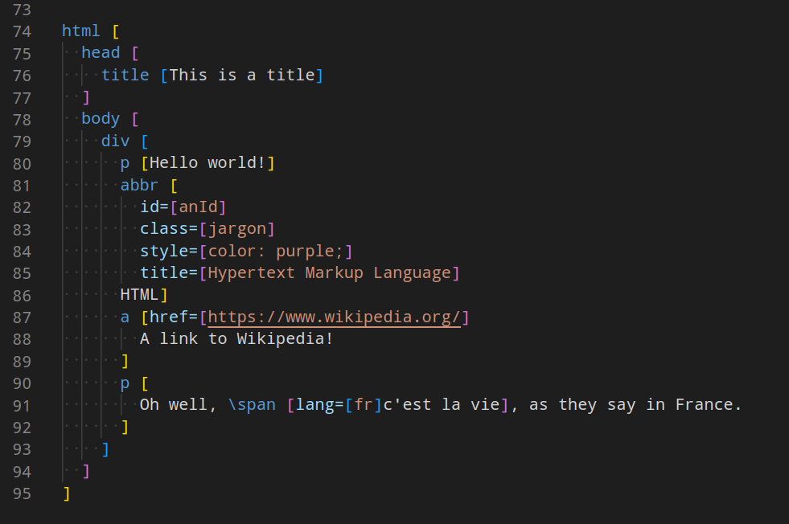

<p style="text-align: center;">
<br/>
<a href="https://jevko.org">jevko.org</a>
</p>

# jevkoml-basic-highlighting-vscode

Basic syntax highlighting for .jevkoml in Visual Studio Code.

NOTE: experimental.

This extension is published to the [Visual Studio Marketplace](https://marketplace.visualstudio.com/items?itemName=jevko.jevkoml-basic-highlighting) as well as the [Open VSX Registry](https://open-vsx.org/extension/jevko/jevkoml-basic-highlighting).

## Installation

Launch VS Code Quick Open (Ctrl+P), paste the following command, and press enter.

```
ext install jevko.jevkoml-basic-highlighting
```

## Jevko CLI

To make this extension useful, it is recommended to install [Jevko CLI](https://github.com/jevko/jevko-cli) -- a command line program which can convert between Jevko formats and HTML/XML/JSON.

## Related extensions

* jevkodata-basic-highlighting: [Visual Studio Marketplace](https://marketplace.visualstudio.com/items?itemName=jevko.jevkodata-basic-highlighting) | [Open VSX Registry](https://open-vsx.org/extension/jevko/jevkodata-basic-highlighting)

## Features

Basic syntax highlighting for .jevkoml that works in Visual Studio Code.



<!-- Includes experimental support for heredocs. -->

<!-- todo: expand on heredocs -->

<!-- ## Requirements

If you have any requirements or dependencies, add a section describing those and how to install and configure them. -->

<!-- ## Extension Settings

Include if your extension adds any VS Code settings through the `contributes.configuration` extension point.

For example:

This extension contributes the following settings:

* `myExtension.enable`: enable/disable this extension
* `myExtension.thing`: set to `blah` to do something -->

<!-- ## Known Issues

There is an unfixable bug where only the lines that contain an opening bracket `[` in Jevko prefixes are properly highlighted.

Other lines look the same as suffixes.

Here is an illustration:


This is impossible to workaround, because TextMate grammars used by Visual Studio Code for basic highlighting are line-oriented, while Jevko is not.

However Visual Studio Code allows more advanced extensions for semantic highlighting which have no such limitations. Once such an extension for Jevko is published, this one will be deprecated. -->

## Release Notes

See [the CHANGELOG](CHANGELOG.md).

## Installation of the latest development snapshot directly from the git repository

To start using this extension with Visual Studio Code copy the folder that contains this repository into the `<user home>/.vscode/extensions` folder and restart Code.

Files with the .jevkoml extension now should have syntax highlighting.